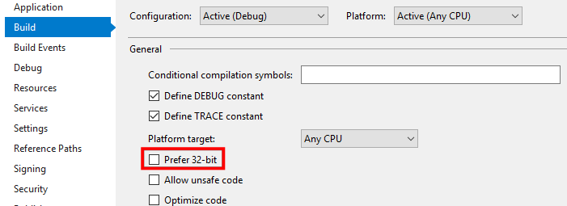
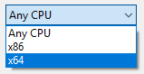

#  Hello World!

This code sample is minimalistic. It's goal is to demonstrate how to wire up an application with the XAYA platform quickly and easily. 

HelloXaya is a typical "Hello World!" example. It wires up the XAYA platform in a Windows forms project. 

HelloXaya lets you say "Hello World!" on the XAYA blockchain. That's all it does.

[Download the HelloXaya project here](Code/HelloXaya.zip).

## Get a XAYA Wallet

You'll need a XAYA wallet and some CHI.

To start, download and install the latest [XAYA Electron wallet here](https://github.com/xaya/xaya_electron/releases) if you're on Windows, or the the [XAYA QT wallet](https://github.com/xaya/xaya/releases) if you're on Linux or Mac. The wallets automatically run the XAYA daemon, i.e. xayad. (This tutorial assumes Windows.)

If you run the QT or xayad, you'll need to set flags manually. They're automatically set in the Electron wallet. For more information on flags, see the [Daemon Flags tutorial](Daemon%20Flags.md).

Run the wallet or xayad and give it time to fully synchronise. 

You should also get some CHI. You can buy CHI at Liquid.com or ask in the Development forum. 1 CHI is lots more than enough to get started. 

## Inside HelloXaya

There are 4 distinct elements inside of HelloXaya.

- HelloXaya project: This is our "game"
- BitcoinLib project: This is used for RPCs
- XAYAWrapper project: This wraps the C++ 64-bit libxayagame statically linked libarary in the XayaStateProcessor folder
- XayaStateProcessor folder: This has the precompiled libxayagame binary for Windows, libxayawrap.dll, and all its dependencies

While this tutorial only explains HelloXaya, you can find more information about other elements elsewhere in the XAYA documentation and tutorials. 

# Important Considerations

[**VIDEO** Set your XAYA project to 64 bit](https://gaming.youtube.com/watch?v=kM6bhzIwYY4)

The XAYAWrapper DLL (libxayawrap.dll) is 64-bit. Consequently, your project **MUST** exclude 32-bit or explicitly be set as 64-bit. See this HelloXaya setting:

Otherwise, you must set your project to be 64-bit (x64). 

# Implementing XAYA Simplified

[**VIDEO** Simplified overview of implementing XAYA](https://gaming.youtube.com/watch?v=w4wPBOfqAjA)

To implement XAYA, all you need to do is to is:

- Instantiate XAYAWraper (1 line of code)
- Connect to XAYAWrapper (1 line of code)
- Set up a listener thread to receive game states
- Implement game logic in:
	+ 3 callbacks
		- initialCallbackResult (20 lines of trivial code)
		- forwardCallbackResult
		- backwardCallbackResult
	+ Ancillary game logic
		- JSON classes
		- Helper methods
- Send moves to the XAYA blockchain
	+ This requires RPCs (can be implemented in many ways)

# Threading

It's crucial that you create threads for XAYAWrapper. 

Portions of XAYAWrapper are blocking operations and **MUST** be run in separate threads. Specifically, the `XAYAWrapper.xayaGameService.WaitForChange` and `XAYAWrapper.Connect` methods. 

## Threading in HelloXaya

In HelloXaya, we've used BackgroundWorkers. There are more robust threading patterns available, but BackgroundWorkers are simple to understand with little complexity. 

You can implement better threading structures on your own. 

# Instantiate and Connect to XAYAWrapper

[**VIDEO** Instantiate and Connect to XAYAWrapper](https://gaming.youtube.com/watch?v=Ge06qTLZ2nE)

Instantiating and Connecting to XAYAWrapper **must** be done in a thread. The connection is a blocking operation. 

However, once connected, XAYAWrapper will immediately begin sending log data to the console and game state data to the listener, i.e. through calling the `XAYAWrapper.xayaGameService.GetCurrentState` method. The log data isn't game state data though; that is examined below. 

To instantiate the wrapper, call it's constructor:

	wrapper = new XayaWrapper(dataPath, // The path to the game's executable file. 
		Properties.Settings.Default.Host, // The host, e.g. localhost or 127.0.0.1
		"8900", // The game host port. Can be any free port.
		ref result, // An error or success message.
		CallbackFunctions.initialCallbackResult, 
		CallbackFunctions.forwardCallbackResult, 
		CallbackFunctions.backwardCallbackResult);

To connect, call the Connect method:

	result = wrapper.Connect(dataPath, // The path to the game's executable file. 
		FLAGS_xaya_rpc_url, // The URL for RPC calls.
		"8900",  // The game host port. Can be any free port.
		"0", // Which network to use: Mainnet, Testnet, or Regtestnet.
		"memory", // The storage type: memory, sqlite, or lmdb.
		"helloworld", // The name of the game in the 'g/' namespace.
		dataPath + "\\..\\XayaStateProcessor\\database\\", // Path to the database folder, e.g. SQLite.
		dataPath + "\\..\\XayaStateProcessor\\glogs\\"); // Path to glog output folder.

# Listening for New GameStates

[**VIDEO** Listening for new GameStates](https://gaming.youtube.com/watch?v=_WwaMVVeECE)

 

We must listen for updates in a thread. There are 4 important lines of code.

In our listener, we use the wrapper to get game states. The first thing to do is to tell the wrapper to wait until there's a new game state.

	wrapper.xayaGameService.WaitForChange();

Once there's a game state, the thread resumes and we get the game state.

	BitcoinLib.Responses.GameStateResult actualState = 
		wrapper.xayaGameService.GetCurrentState();

We then cast that as a `GameState` by deserialising the JSON.

	state = JsonConvert.DeserializeObject<GameState>(actualState.gamestate);

The final step in our listening thread is to send the game state to the main UI thread.

	sendingWorker.ReportProgress(0, state);

# Update the UI with the New GameState

[**VIDEO** Update the UI with the New GameState](https://gaming.youtube.com/watch?v=hqnFEUSNg7w)

 

Our listener thread casts the event argument as a `GameState` and sends it to a method that updates the game.

	UpdateHelloChat((GameState)e.UserState);

HelloXaya merely updates a text box with what other people have said. It loops through all players and stores data in a StringBuilder.

	sb.AppendLine(v.Key + " said \"" + v.Value.hello + "\"");

We then update the textbox in the UI.

	txtHelloGameState.Text = sb.ToString();

# Sending Moves to the Blockchain

[**VIDEO** Sending Moves to the Blockchain](https://gaming.youtube.com/watch?v=w-dIikNq8Gg)

 

You don't need to be running an instance of a game to send moves. 

Moves can be sent arbitrarily in many ways. Here are some ways:

- From xaya-cli
- From the XAYA QT console
- Sending to xayad
- Etc.

When processing moves, you **must** guard against invalid moves with robust error checking. See the code for example error checks. 

In HelloXaya, we build the move in a string then send it:

	string hello = "{\"g\":{\"helloworld\":{\"m\":\"" + txtHelloWorld.Text + "\"}}}";
	xayaService.NameUpdate(this.cbxNames.GetItemText(this.cbxNames.SelectedItem), 
		hello, 
		new object());

<!-- # Game Logic

As mentioned above, game logic is handled similar to the following:

- 3 callbacks
	- initialCallbackResult
	- forwardCallbackResult
	- backwardCallbackResult
- Ancillary game logic
	- JSON classes
	- Helper methods

THIS IS A STUB. THIS PORTION OF THE HELLO WORLD TUTORIAL WILL FOLLOW. -->

Done!

