# How do I...?

The following sections are dedicated to showing you how to perform specific tasks.

Click in the side navigation panel for specific tasks.

- [Encrypt Vault Wallet](#Encrypt-vault-wallet)
- [Get a New Wallet](#Get-a-new-wallet)
- [Back up wallets](#Back-up-wallets)
	+ ["Safe Location"](#safe-location)
	+ [Wallet Backup Feature](#Wallet-Backup-Feature)
	+ [Manually Backing Up Wallets](#manually-backing-up-wallets)
	+ [File-based Backups](#file-based-backups)
	+ [XAYA QT Wallet Folder](#xaya-qt-wallet-folder)
	+ [XAYA Electron Wallets Folders](#xaya-electron-wallets-folders)
	+ [Backing Up Wallet Files](#backing-up-wallet-files)
- [Buy CHI](#Buy-chi)
- [Get an Account Name](#Get-an-account-name)
- [Transfer a Name](#Transfer-a-name)
- [Mine CHI](#Mine-chi)
- [Get Support](#Get-support)
- [Fix Stuck Wallet](#Fix-stuck-wallet)

— [Top](#top) — [Encrypt Vault Wallet](#Encrypt-vault-wallet) — [Get a New Wallet](#Get-a-new-wallet) — [Back up wallets](#Back-up-wallets) — [Buy CHI](#Buy-chi) — [Get an Account Name](#Get-an-account-name) — [Transfer a Name](#Transfer-a-name) — [Mine CHI](#Mine-chi) — [Get Support](#Get-support) — [Fix Stuck Wallet](#Fix-stuck-wallet) — 

# Encrypt Vault Wallet

It is STRONGLY recommended that you encrypt your vault wallet. This will help to 
keep the CHI and blockchain assets in it secure.

You must back up your vault wallet after you encrypt it and ensure that you have 
stored your password for it safely. Failure to do so could result in lost CHI 
and lost blockchain assets.

> Once you've encrypted your vault wallet, you'll no longer be nagged continually and forever by the XAYA Electron wallet to encrypt your vault wallet... and it will nag you forever... until you encrypt your vault wallet... with a password that you 100% promise to never lose or forget. Right?

Ideally, you should start with a 0 balance in your vault wallet and have no 
blockchain assets or names stored in it. The purpose here is to test your newly 
encrypted wallet with zero risk.

The following shows how to encrypt your wallet in a conservative (paranoid) 
manner that seeks to eliminate potential errors.

1. If you have any coins in your vault wallet, send them all to your game 
wallet. Check the "Subtract fee from amount?" checkbox. See [here for how to 
send coins](#send). Similar for other blockchain assets, i.e. names. 
Transfer 
any names to your game wallet. See [here for how to transfer 
names](#transfer-a-name).

2. Your empty vault wallet should look like this:  
   
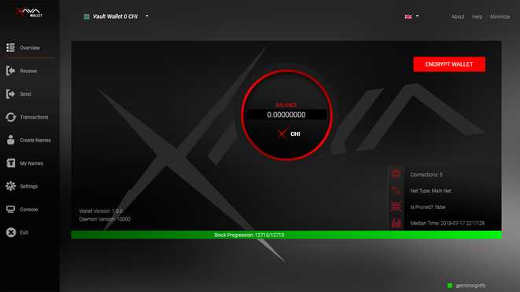

3. Decide on a password that you would like to use, and write it down or store 
it in a safe location, ideally in a password manager.

4. Click ENCRYPT WALLET.

5. Enter your password into the password field and click the ENCRYPT WALLET button. 
Ideally, you should copy your password from your password manager. It is 
possible that if you type your password, you could mistype it and that you could 
mistype it when you confirm your password. Copying your password from your 
password manager is the safest way to ensure that you enter your password 
correctly. 
    
     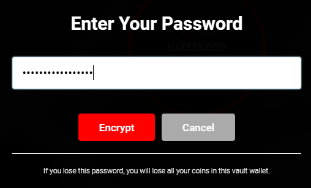
    
6. Confirm your password by entering it in again and clicking the Encrypt button. Pay attention to what happens next.
     
    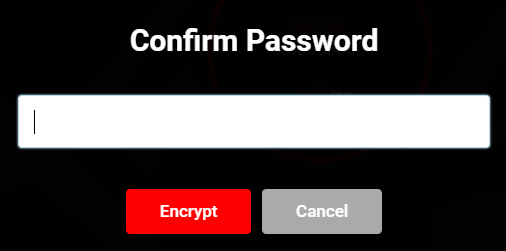
    
7. If your passwords don't match, you'll see this error message. Start again at step 5. 
    
    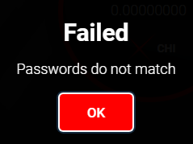
    
8. If your passwords match, you'll see this message but only briefly. The wallet software will automatically close. 
    
    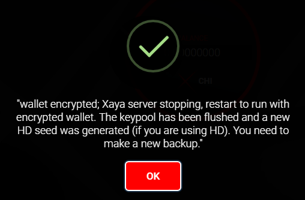
    
9. Restart the wallet software.
    
10. Ensure that the vault wallet is selected. See [here for how to select the vault wallet](#wallets).
    
11. Test your new password by clicking UNLOCK WALLET in the upper-right corner of the wallet on the [Overview screen](#overview) and entering your password. 
    
    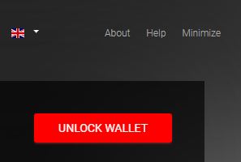
    
12. If your wallet was successfully unlocked, you will see a message in the upper-right corner of the wallet on the [Overview screen](#overview).  
    
    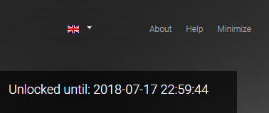
    
13. If you did not enter your password correctly, you will see a message similar to the figure below.  
    
    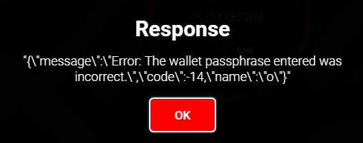
    
14. If you entered the wrong password, start again at step 11. If the error 
persists, then you've failed to properly encrypt your wallet with a password 
that you can reliably enter. (This is why your wallet should be empty as per the 
notice above in step 1.) See [Get a New Wallet](#get-a-new-wallet) for 
information on how to get a new vault wallet to encrypt. After that, start over 
at step 1.

— [Top](#top) — [Encrypt Vault Wallet](#Encrypt-vault-wallet) — [Get a New Wallet](#Get-a-new-wallet) — [Back up wallets](#Back-up-wallets) — [Buy CHI](#Buy-chi) — [Get an Account Name](#Get-an-account-name) — [Transfer a Name](#Transfer-a-name) — [Mine CHI](#Mine-chi) — [Get Support](#Get-support) — [Fix Stuck Wallet](#Fix-stuck-wallet) — 

# Get a New Wallet

If for any reason you want or need a new wallet, it's very simple to do.

> This is simple for advanced users. If you aren't comfortable working outside of regular user folders, proceed with caution and always make backups of your wallets as described in <a href="Navigation.md#backing-up-your-wallets">Settings</a>.

The XAYA Electron wallet has 2 wallets: a game wallet and a vault wallet. They 
are located here:

C:\\Users\\\<user>\\AppData\\Roaming\\Xaya\\wallets

On Linux with the QT wallet software, the wallet is located here:

~/.xaya/wallets

Or here:

~/home/\<user>/xaya/wallets

On OS X (Mac) with the QT wallet software, they are here:

~/Library/Application Support/Xaya/wallets/

On Windows, in that folder are 2 folders:

* game.dat
* vault.dat

Inside of each of those folders is a wallet.dat file.

To replace a wallet.dat file:

1. Shut down your wallet software if it's not already shut down.

2. Navigate to the folder of the wallet that you wish to replace.

3. Rename the wallet.dat file with a description that's meaningful to you. For 
example:  
   
Old wallet - empty.dat  
   
By renaming your wallet, you can go back and rename it back to wallet.dat so 
that you can use it again.  
   
At this stage, you will not have a file named "wallet.dat" in that folder.  
 

4. Restart your XAYA Electron wallet. It will automatically create a new, empty 
wallet.dat for you.

Take note that the process above does not delete the old wallet.dat file. If you 
are certain that the wallet has nothing of value, you may wish to delete it. If 
you are replacing a wallet because you have lost the password, you should still 
keep the wallet as it may be possible to retrieve the wallet's password.

— [Top](#top) — [Encrypt Vault Wallet](#Encrypt-vault-wallet) — [Get a New Wallet](#Get-a-new-wallet) — [Back up wallets](#Back-up-wallets) — [Buy CHI](#Buy-chi) — [Get an Account Name](#Get-an-account-name) — [Transfer a Name](#Transfer-a-name) — [Mine CHI](#Mine-chi) — [Get Support](#Get-support) — [Fix Stuck Wallet](#Fix-stuck-wallet) — 

# Back Up Wallets

It is critically important that you back up your wallets. Failure to do so could 
result in the loss of your CHI and blockchain assets.

There are 2 ways to back up your wallets.

* [Use the back up feature in the XAYA Electron wallet to back them up to a safe 
location](#backing-up-your-wallets) 
* [Manually back up your wallets by copying them to a safe 
location](#manually-backing-up-wallets) 

## "Safe Location"

Your back ups should be stored in a "safe location". This will have different 
meanings for different people. One person may want a physical printout and 
multiple USB sticks stored in a bank vault, while another considers a file 
backup on the same drive a safe location. This has entirely to do with your risk 
tolerance and what you consider safe. The following backup methods are to help 
you decide on what is right for you.

## Wallet Backup Feature

The easiest way to back up your wallets is to use the backup feature in 
[Settings](#settings).

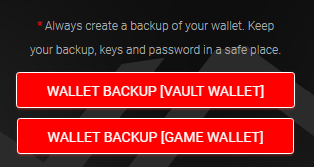

[Click here for help with the built-in backup 
feature](#backing-up-your-wallets).

> Unless you are comfortable with manual backups, you should only use the built-in backup feature.

## Manually Backing Up Wallets

The following explains in detail how to back up your wallets manually.

> NOTE: This is for advanced users. If you have any difficulty whatsoever with anything below, you should use the backup features in the Electron or QT wallet software.

## File-based Backups

XAYA has 3 distinct wallets depending on which wallet software you are running. 
One wallet is used by the XAYA QT wallet, while the XAYA Electron wallet has 2 
wallets, the game and vault wallets. You only need to copy each wallet.dat file 
to a safe location to back them up.

[Click here to skip to the wallet 
locations](#xaya-qt-wallet-folder).

## XAYA QT Wallet Folder

The XAYA QT wallet can be found in the datadir wallets folder on Windows here:

%APPDATA%\\Xaya\\wallets\\

e.g. C:\\Users\\\<user>\\AppData\\Roaming\\Xaya\\wallets\\

On Linux the wallet folder is here:

~/.xaya/wallets/

Or here:

~/home/\<user>/xaya/wallets/

On OS X (Mac) the wallet folder is here:

~/Library/Application Support/Xaya/wallets/

## XAYA Electron Wallets Folders

The XAYA Electron wallets are in the game.dat and vault.dat subfolders. On 
Windows, those are here:

%APPDATA%\\Xaya\\wallets\\game.dat\\

%APPDATA%\\Xaya\\wallets\\vault.dat\\

e.g.

C:\\Users\\\<user>\\AppData\\Roaming\\Xaya\\wallets\\game.dat\\

C:\\Users\\\<user>\\AppData\\Roaming\\Xaya\\wallets\\vault.dat\\

The XAYA Electron wallet is not yet available for Linux or OS X (Mac).

## Backing Up Wallet Files

Backing up wallet files is only a matter of copying them to a safe location. The 
Electron wallet has 2 wallet files while the QT wallet has only 1 wallet file.

The 3 possible wallet locations to back up are:

%APPDATA%\\Xaya\\wallets\\wallet.dat

%APPDATA%\\Xaya\\wallets\\game.dat\\wallet.dat

%APPDATA%\\Xaya\\wallets\\vault.dat\\wallet.dat

Or on Linux for the QT wallet:

~/.xaya/wallets/wallet.dat

And on OS X for the QT wallet:

~/Library/Application Support/Xaya/wallets/wallet.dat

If you haven't run the XAYA QT wallet, you will not have that file. This is 
normal.

To back up a wallet file:

1. Shut down the wallet software.

2. Copy the wallet.dat file to 1 or more safe backup locations.

3. Restart your wallet software.

— [Top](#top) — [Encrypt Vault Wallet](#Encrypt-vault-wallet) — [Get a New Wallet](#Get-a-new-wallet) — [Back up wallets](#Back-up-wallets) — [Buy CHI](#Buy-chi) — [Get an Account Name](#Get-an-account-name) — [Transfer a Name](#Transfer-a-name) — [Mine CHI](#Mine-chi) — [Get Support](#Get-support) — [Fix Stuck Wallet](#Fix-stuck-wallet) — 

# Buy CHI

CHI can be purchased from anyone willing to sell it. The XAYA team has no 
control over who buys or sells CHI.

CHI may be purchased on an exchange.

Check the XAYA forums at <a href="https://forum.xaya.io/" >https://forum.xaya.io/</a> or 
Telegram channel at <a href="https://t.me/xaya_en" >https://t.me/xaya_en/</a> for any 
exchange listings.

— [Top](#top) — [Encrypt Vault Wallet](#Encrypt-vault-wallet) — [Get a New Wallet](#Get-a-new-wallet) — [Back up wallets](#Back-up-wallets) — [Buy CHI](#Buy-chi) — [Get an Account Name](#Get-an-account-name) — [Transfer a Name](#Transfer-a-name) — [Mine CHI](#Mine-chi) — [Get Support](#Get-support) — [Fix Stuck Wallet](#Fix-stuck-wallet) — 

# Get an Account Name

Names are used as accounts inside of games. See [Create 
Names](#create-names) 
for information on how to create your own names.

— [Top](#top) — [Encrypt Vault Wallet](#Encrypt-vault-wallet) — [Get a New Wallet](#Get-a-new-wallet) — [Back up wallets](#Back-up-wallets) — [Buy CHI](#Buy-chi) — [Get an Account Name](#Get-an-account-name) — [Transfer a Name](#Transfer-a-name) — [Mine CHI](#Mine-chi) — [Get Support](#Get-support) — [Fix Stuck Wallet](#Fix-stuck-wallet) — 

# Transfer a Name

You can transfer names between your game and vault wallet, or you can transfer a 
name to another person using one of their CHI addresses.

To transfer a name:

1. Click [My Names](#my-names) in the left-side navigation.

2. Find the name that you wish to transfer.

3. On the right-hand side on the same line as the name you wish to transfer, 
click TRANSFER.  
   
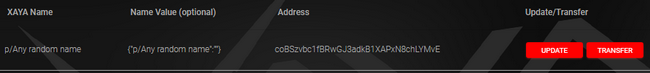  
 

4. Paste the address that you want to transfer the name to in the input.  
   
  
 

5. Click OK to transfer the name.

6. A dialog with the transaction ID appears. Click OK to close it.  
   
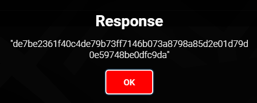

Your name will remain in your wallet while the transfer is being confirmed. Once 
it is confirmed, it will disappear.

Once you have transferred the name to your other wallet, you can check [My 
Names](#my-names) or [Transactions](#transactions) in that wallet.

— [Top](#top) — [Encrypt Vault Wallet](#Encrypt-vault-wallet) — [Get a New Wallet](#Get-a-new-wallet) — [Back up wallets](#Back-up-wallets) — [Buy CHI](#Buy-chi) — [Get an Account Name](#Get-an-account-name) — [Transfer a Name](#Transfer-a-name) — [Mine CHI](#Mine-chi) — [Get Support](#Get-support) — [Fix Stuck Wallet](#Fix-stuck-wallet) — 

# Mine CHI

Mining is a complex topic and beyond the scope of this help file.

See the <a href="https://forum.xaya.io/forum/14-mining/" >Mining forum</a> for information 
and help.

— [Top](#top) — [Encrypt Vault Wallet](#Encrypt-vault-wallet) — [Get a New Wallet](#Get-a-new-wallet) — [Back up wallets](#Back-up-wallets) — [Buy CHI](#Buy-chi) — [Get an Account Name](#Get-an-account-name) — [Transfer a Name](#Transfer-a-name) — [Mine CHI](#Mine-chi) — [Get Support](#Get-support) — [Fix Stuck Wallet](#Fix-stuck-wallet) — 

# Get Support

Visit the <a href="https://forum.xaya.io/forum/16-support/" >XAYA Support forum</a> for 
general support.

— [Top](#top) — [Encrypt Vault Wallet](#Encrypt-vault-wallet) — [Get a New Wallet](#Get-a-new-wallet) — [Back up wallets](#Back-up-wallets) — [Buy CHI](#Buy-chi) — [Get an Account Name](#Get-an-account-name) — [Transfer a Name](#Transfer-a-name) — [Mine CHI](#Mine-chi) — [Get Support](#Get-support) — [Fix Stuck Wallet](#Fix-stuck-wallet) — 

# Fix Sync Problems

There are different reasons why your wallet may get stuck synchronising. 

Advanced users may wish to run the wallet from the command line with a "-reindex" and/or "-rescan" option. 

You can also delete the blockchain data and resynchronise. See [Delete Chain](#delete-chain) for more information.

— [Top](#top) — [Encrypt Vault Wallet](#Encrypt-vault-wallet) — [Get a New Wallet](#Get-a-new-wallet) — [Back up wallets](#Back-up-wallets) — [Buy CHI](#Buy-chi) — [Get an Account Name](#Get-an-account-name) — [Transfer a Name](#Transfer-a-name) — [Mine CHI](#Mine-chi) — [Get Support](#Get-support) — [Fix Stuck Wallet](#Fix-stuck-wallet) — 

