# Navigation Tabs

- [Overview](#overview)
	+ [Balance](#Balance)
	+ [Network Info](#Network-Info)
	+ [Version](#version)
	+ [Block Progression](#Block-Progression)
- [Receive](#receive)
- [Send](#send)
- [Transactions](#Transactions)
- [Create Names](#Create-Names)
	+ [Choosing an Account Name](Navigation.md#choosing-an-account-name)
	+ [Choosing a Game Name](Navigation.md#choosing-a-game-name)
	+ [Choosing a Custom Namespace](Navigation.md#choosing-a-custom-namespace)
- [My Names](#My-Names)
	+ [Updating a Name](Navigation.md#updating-a-name)
	+ [Transferring a Name](Navigation.md#transferring-a-name)
- [Settings](#Settings)
	+ [Backing Up Your Wallets](Navigation.md#backing-up-your-wallets)
	+ [Delete Chain](Navigation.md#delete-chain)
	+ [Testnet](Navigation.md#Testnet)
- [Console](#Console)
- [Exit](#Exit)

— [Top](#top) — [Overview](#overview) — [Receive](#receive) — [Send](#send) — [Transactions](#Transactions) — [Create Names](#Create-Names) — [My Names](#My-Names)  — [Settings](#Settings) — [Console](#Console) — [Exit](#Exit) — 

# Overview

The Overview is the "home" screen for the wallet.

It displays basic information about how many coins you have, network 
information, version information, and the block synchronization of the wallet.

— [Top](#top) — [Overview](#overview) — [Receive](#receive) — [Send](#send) — [Transactions](#Transactions) — [Create Names](#Create-Names) — [My Names](#My-Names)  — [Settings](#Settings) — [Console](#Console) — [Exit](#Exit) — 

## Balance

The Balance area on the Overview screen displays how much CHI you have in the 
[currently selected wallet](Top.md#wallets).

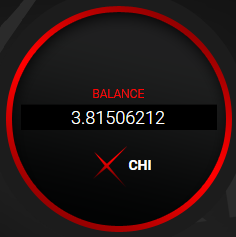

It displays the amount in full to 8 decimal places.

Should you "be surprised" at an amount in your wallet, it may be that you've 
simple got the wrong one selected.

See [Wallets](Top.md#wallets) for more information.

## Network Info

The Network Info area displays basic information about the blockchain.

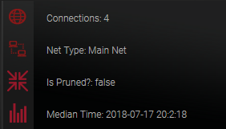

* **Connections:** Shows how many active connections you have to other XAYA nodes 
around the world.
* **Net Type:** Tells you whether you are on mainnet (this is where you play games) or 
on testnet (this is where testing is done).
* **Is Pruned?:** Tells you whether you're running with the full blockchain (false) or 
with a shorter version (true).
* **Median Time:** Just the time. It updates periodically, and not in real time.

## Version

The version area displays the current XAYA Electron wallet version and the 
current XAYA daemon version.

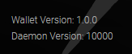

## Block Progression

The Block Progression area shows you the latest block that you've downloaded 
from the network, and the current block height. If they are equal, your wallet 
is (probably) synchronised with the network.

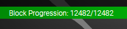

If you cannot get your wallet to synchronise properly, visit the <a href="https://forum.xaya.io/" >XAYA 
forums</a> and post in the <a href="https://forum.xaya.io/forum/16-support/" >Support 
forum</a>.

> It is possible that during a lengthy synchronisation, the two numbers could be equal for a very short period without your wallet being fully synchronised due to there being more blocks to be downloaded still. This is rare and only lasts a very short time.

— [Top](#top) — [Overview](#overview) — [Receive](#receive) — [Send](#send) — [Transactions](#Transactions) — [Create Names](#Create-Names) — [My Names](#My-Names)  — [Settings](#Settings) — [Console](#Console) — [Exit](#Exit) — 

# Receive

The Receive screen lets you create CHI addresses where you can receive CHI.

To create an address:

1. In the Address Label input, enter a label, e.g. "My address".

2. Click INSERT.

3. Your new address appears in the Receiving Addresses list.

You can select the address and press CTRL+C or you can click COPY to copy the 
address to the clipboard.

— [Top](#top) — [Overview](#overview) — [Receive](#receive) — [Send](#send) — [Transactions](#Transactions) — [Create Names](#Create-Names) — [My Names](#My-Names)  — [Settings](#Settings) — [Console](#Console) — [Exit](#Exit) — 

# Send

The Send screen lets you send CHI to other people at their CHI addresses.

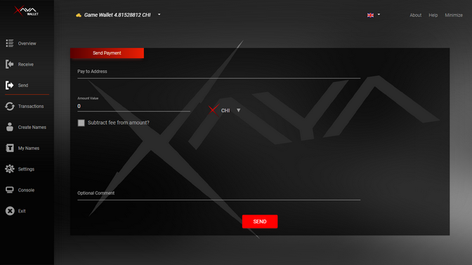

To send CHI to another CHI address:

1. Paste the address into the Pay to Address input. (Do not type addresses.)

2. Enter how much CHI you want to send into the Amount Value input.

3. Optionally, you can choose to enter the amount in CHI, mCHI or uCHI. (Using 
the default CHI is recommended.)

4. Check whether or not fees should be subtracted from the amount you are 
sending.

5. Optionally, you can enter a comment, e.g. "Sending 5 CHI to Alice".

6. Click SEND.

You can check your transaction on the [Transactions screen](#transactions).

> DO NOT TYPE ADDRESSES.
>
> Typing address is highly discouraged. You could make a simple mistake, and lose your CHI.
>
> We **STRONGLY** recommend copying and pasting addresses.
>
> The Send screen is not for transferring names. See <a href="#transferring-a-name">Transferring a name</a> for more information.

— [Top](#top) — [Overview](#overview) — [Receive](#receive) — [Send](#send) — [Transactions](#Transactions) — [Create Names](#Create-Names) — [My Names](#My-Names)  — [Settings](#Settings) — [Console](#Console) — [Exit](#Exit) — 

# Transactions

The Transactions screen has a complete record of your transaction history.

The relevant fields are:

* **Address:** The address in your wallet involved in the transaction.
* **Name/Label:** If the transaction was for a name, then relevant name information 
is displayed here. Often these are game moves.
* **Category:** This tells you whether you sent or received CHI, as well as whether 
the coins are generated (mined).
* **Amount:** This is the amount of CHI. Sent CHI are negative, and received CHI are 
positive.
* **Date:** This is the date and time of the transaction in YYYY-MM-DD HH:MM:SS 
format.
* **Confirmations:** This is the number of confirmations for the transaction. 
Loosely speaking, this is how many blocks have been mined since then.

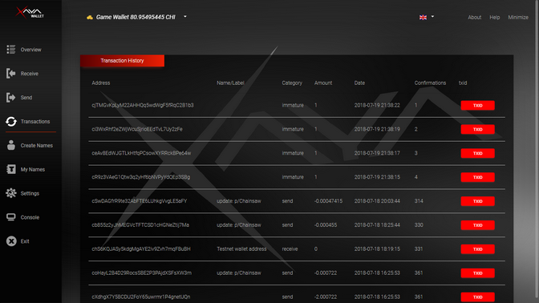

Once you scroll to the bottom, you can click the PREV or NEXT buttons to view 
more transactions.

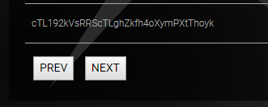

— [Top](#top) — [Overview](#overview) — [Receive](#receive) — [Send](#send) — [Transactions](#Transactions) — [Create Names](#Create-Names) — [My Names](#My-Names)  — [Settings](#Settings) — [Console](#Console) — [Exit](#Exit) — 

# Create Names

Creating names is one of the most important aspects of the wallet. Here you can 
create names for accounts that you use for different games.

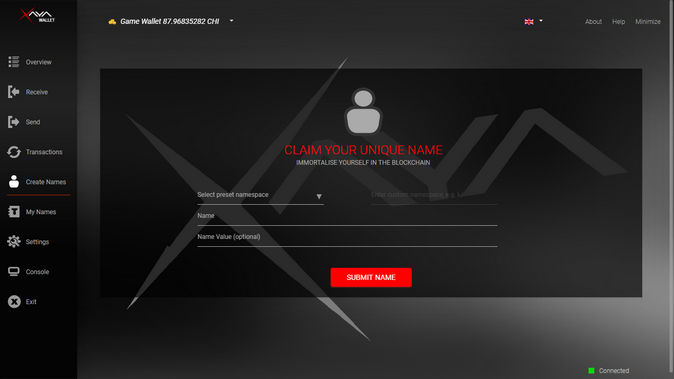

## Choosing an Account Name

To create a name for use as an account for games:

1. Choose the "p/" namespace from the Select preset namespace drop-down menu. 
This is for reserving account names.  
   
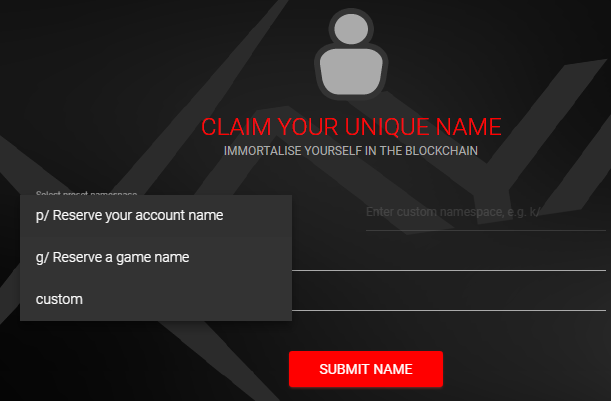  
 

2. Type a name in the Name input.  
   
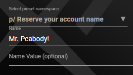  
 

3. Leave the Name Value input empty.

4. Click SUBMIT NAME.

You can check your acount name on the [My Names screen](#my-names).

## Choosing a Game Name

This is not the actual name of your game. XAYA uses "name" as jargon. Here, a 
"game name" is more traditionally best described as a "game ID".

To create a name for use as game name:

1. Choose the "g/" namespace from the Select preset namespace drop-down menu. 
This is for reserving game names.  
   
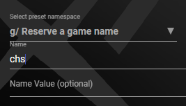  
 

2. Type a name in the Name input as shown above.

3. Leave the Name Value input empty.

4. Click SUBMIT NAME.

You can check your game name on the [My Names screen](#my-names).

## Choosing a Custom Namespace

Custom namespaces are reserved for further development.

There is little to no point in reserving a name in a custom namespace. Some developers may find a use, but are discouraged from using custom namespaces without serious consideration. 

— [Top](#top) — [Overview](#overview) — [Receive](#receive) — [Send](#send) — [Transactions](#Transactions) — [Create Names](#Create-Names) — [My Names](#My-Names)  — [Settings](#Settings) — [Console](#Console) — [Exit](#Exit) — 

# My Names

The My Names screen lists all of the names that you've reserved for yourself. 
The following example has 1 name, but you could have many more.

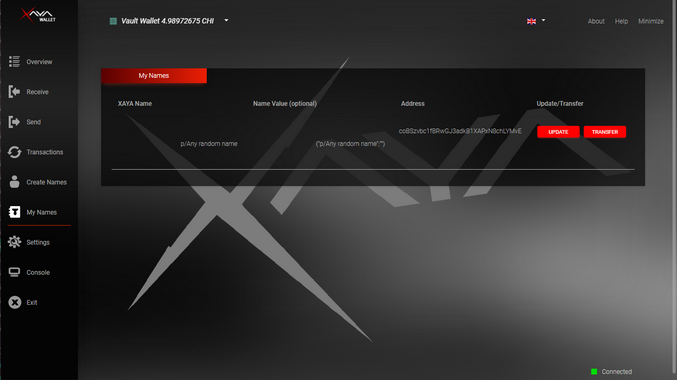

There are 4 columns:

* **XAYA Name:** This is the proper name that you've reserved.
* **Name Value (optional):** This is simply the JSON expression of your name.
* **Address:** This is the CHI address for your name.
* **Update/Transfer:** This allows you to change the properties of your name or to 
transfer your name (account) to someone else.

## Updating a Name

Unless you fully understand what an update is, you should NOT update your name. 
Updating names is an advanced feature meant for experts.

## Transferring a Name

You can transfer a name to someone else by sending the name to a valid CHI 
address.

1. Click TRANSFER for the name you wish to transfer.

2. Paste in the CHI address that you want to transfer the name to.  
   
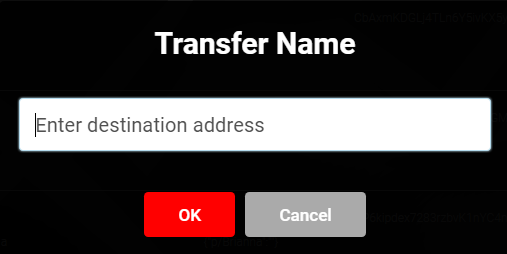  

3. Click OK.

The name is transferred to the address. You can check the transaction on the 
[Transactions screen](#transactions).

— [Top](#top) — [Overview](#overview) — [Receive](#receive) — [Send](#send) — [Transactions](#Transactions) — [Create Names](#Create-Names) — [My Names](#My-Names)  — [Settings](#Settings) — [Console](#Console) — [Exit](#Exit) — 

# Settings

The Settings screen lets you change connection settings, back up your wallets, 
and switch to testnet.

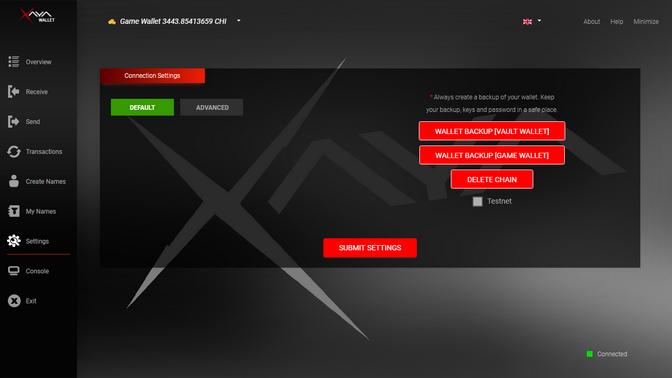

Advanced users can change connection settings.

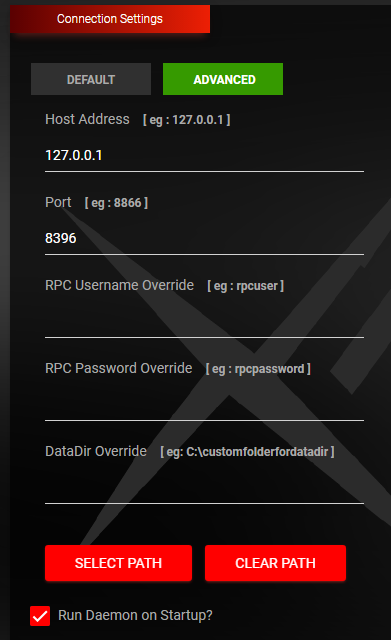

Unless you fully understand the connection settings, you should leave them as 
is.

Advanced users and miners can make the changes they need, then click the SUBMIT 
SETTINGS button to save their new connection settings.

The DataDir Override allows you to change the directory where the XAYA 
blockchain, wallets, and other data is stored. The default directory is:

%APPDATA%\\Xaya\\

e.g. C:\\Users\\\<user>\\AppData\\Roaming\\Xaya

On Linux the datadir is here:

~/.xaya/

Or here:

~/home/\<user>/xaya/

On OS X (Mac) the datadir is here:

~/Library/Application Support/Xaya/

People with limited space on their system drive may wish to change the datadir 
folder location.

## Backing Up Your Wallets

You can back up your wallets by clicking the wallet backup buttons.

1. Click either of the WALLET BACKUP buttons.

2. Browse to a folder where you want to back up your wallet.  
   
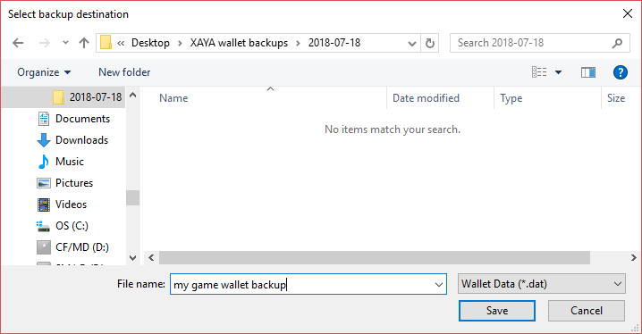

3. Accept the default backup filename (either "game.dat" or "vault.dat"), or enter a name for your backup as illustrated in the figure above.

4. Click the Save button.

5. Click OK.  
   
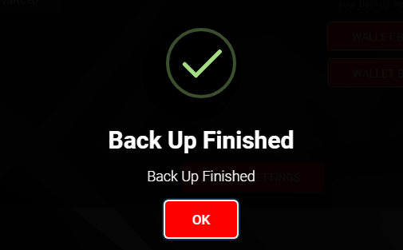  
 

6. Browse to your backup in your file explorer and perform any additional backup 
plans you have, e.g. save it to a USB stick or external drive.

See [Back Up Wallets](#back-up-wallets) for additional information or 
[Manually Backing Up Wallets](#manually-backing-up-wallets) for 
how to do it manually.

## Delete Chain

If your wallet will not fully synchronise, you can click DELETE CHAIN to delete the current blockchain data and resynchronise. This should get your wallet properly sync'ing again. 

> Keep in mind that it can take a significant amount of time to fully resync your wallet, and largely depends on your network speed.  

If you still experience problems, post in the <a href="https://forum.xaya.io/forum/16-support/" >Support forums here</a>. 

## Testnet

> Most people have no need for testnet. Proceed with caution. 

To switch to testnet, check the Testnet checkbox then click the SUBMIT SETTINGS 
button and restart the XAYA Electron wallet.

Testnet is used for testing. Most people have no need for testnet.

However, if you wish, you can use testnet to try out different features and 
become familiar with them before you "go live" and try them on mainnet.

— [Top](#top) — [Overview](#overview) — [Receive](#receive) — [Send](#send) — [Transactions](#Transactions) — [Create Names](#Create-Names) — [My Names](#My-Names)  — [Settings](#Settings) — [Console](#Console) — [Exit](#Exit) — 

# Console

The console is for testing purposes only. It is provided for those who wish to 
get blockchain information and should not be used to write to the blockchain.

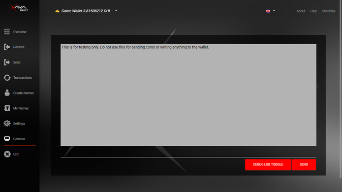

Type "help" then press Enter or click SEND for a list of commands.

> Not all commands are supported in the XAYA Electron wallet. Use the XAYA QT wallet for full support.

An example of a useful command is "getmininginfo". It returns the current 
results, similar to the figure below.

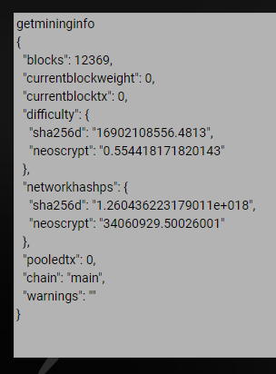

Those wishing to perform more advanced operations should work with the XAYA 
daemon directly or download the XAYA QT wallet. It is similar to the Bitcoin 
Core wallet.

— [Top](#top) — [Overview](#overview) — [Receive](#receive) — [Send](#send) — [Transactions](#Transactions) — [Create Names](#Create-Names) — [My Names](#My-Names)  — [Settings](#Settings) — [Console](#Console) — [Exit](#Exit) — 

# Exit

The Exit menu item shuts down the XAYA Electron wallet and the XAYA daemon.

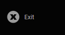

You must have the daemon running in order to play games or interact with the 
XAYA blockchain. The wallet is a convenient GUI wrapped around the daemon.

— [Top](#top) — [Overview](#overview) — [Receive](#receive) — [Send](#send) — [Transactions](#Transactions) — [Create Names](#Create-Names) — [My Names](#My-Names)  — [Settings](#Settings) — [Console](#Console) — [Exit](#Exit) — 

