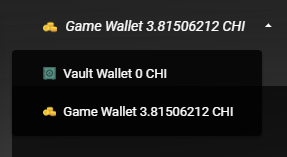
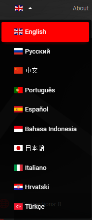
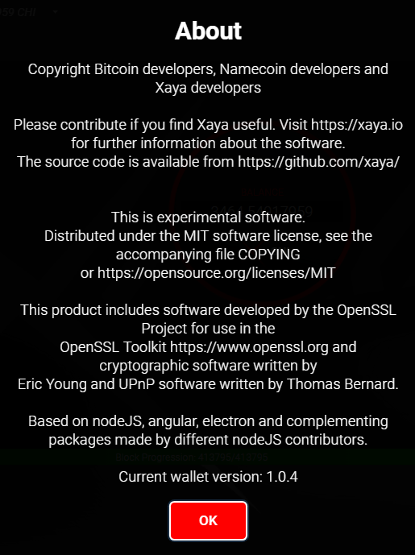
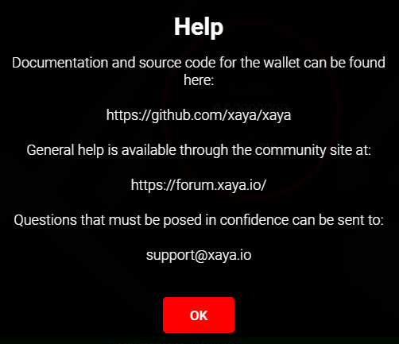
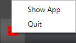

# Top Navigation

- [Wallets](#Wallets)
	+ [Vault Wallet](#Vault-wallet)
	+ [Game Wallet](#Game-wallet)
	+ [Very Basic Security Tips](#very-basic-security-tips)
- [Language](#Language)
- [About](#About)
- [Help](#Help)
- [Minimize](#Minimize)

— [Top](#top) — [Wallets](#Wallets)  —  [Language](#Language) — [About](#About)  — [Help](#Help)  — [Minimize](#Minimize)  —   

# Wallets

The XAYA Electron wallet supports 2 distinct wallets.

1. Vault wallet

2. Game wallet

You can switch between wallets using the wallet selector in the upper-left 
corner of the XAYA Electron wallet.

> The term "wallet" refers to several distinct things.

> • The wallet software, e.g. XAYA Electron wallet, or XAYA QT wallet

> • The individual wallets inside of the software, i.e. the vault wallet and game wallet. These are the wallet.dat files inside of the game.dat and vault.dat folders in the datadir (%APPDATA%\Xaya\, C:\Users\< user >\AppData\Roaming\Xaya, etc.).

## Vault Wallet

Your vault wallet is designed to be encrypted. This is where you should store 
most of your CHI and valuable blockchain assets that you're not currently using.

Once you've encrypted your wallet, you MUST back it up again. Your previous 
unencrypted wallets will not be sufficient.

See [here for how to encrypt your vault wallet](#encrypt-vault-wallet).

You can back up your vault wallet on the [Settings screen](#settings).

Further, you MUST store your password in a safe place. If you lose your 
password, you may lose your CHI and any assets that were stored in your vault 
wallet.

To reiterate, **BACK UP YOUR WALLET AND STORE YOUR PASSWORD IN A SAFE PLACE**.

> Did we mention that <b>BACKING UP YOUR WALLETS</b> is a good idea?

## Game Wallet

> Your game wallet should NOT be encrypted. Leaving it unencrypted makes it easier and faster to do moves in games. If it were encrypted, you'd have to enter your password every time you made a move. This would be cumbersome, inconvenient, and could make some games effectively unplayable.

The game wallet is what you will be using most of the time.

You can back up your game wallet on the [Settings screen](#settings).

> In case we forgot to mention it, <b>BACKING UP YOUR WALLETS</b> is a good idea.

## Very Basic Security Tips

The basic security advice here is basic, and not exhaustive. You may wish to use 
better security practices.

> Never give anyone your wallet.dat file or password.

Physical security is important. Do not run XAYA wallet software on computers 
that other people have access to. If you must run the software on a computer 
that other people have access to, you run the risk of those people stealing your 
CHI and blockchain assets. Consider running a portable version of the wallet 
software from a portable SSD.

Consider using password management software. Remember to back up your password 
database and any other relevant data.

If you have a significant amount of CHI, avoid talking about how much you have. 
Practice good online security and don't give out personal information.

Use reputable anti-virus software and avoid installing questionable software. 
Also, be judicious in which websites you visit on any computer that you are 
running wallet software on.

Ultimately you and only you are responsible for your security. There is a great 
amount of information on computer security available online. It can even be fun.

> Being as 3 is a magic number, we should mention that <b>BACKING UP YOUR WALLETS</b> is a good idea!

— [Top](#top) — [Wallets](#Wallets)  —  [Language](#Language) — [About](#About)  — [Help](#Help)  — [Minimize](#Minimize)  —  

# Language

The language drop-down menu lets you switch languages.

Ten languages are currently supported. More language will follow.

Anyone wishing to help with translations can <a href="https://github.com/xaya/xaya_electron/tree/master/src/assets/i18n" >find the language resources at the 
open source Github respository 
here</a>.

— [Top](#top) — [Wallets](#Wallets)  —  [Language](#Language) — [About](#About)  — [Help](#Help)  — [Minimize](#Minimize)  —  

# About

The About dialog has some basic information about the wallet, including license 
and copyright information.

XAYA is open source. Source code is available at the <a href="https://github.com/xaya/" >XAYA Github respository here</a>.

XAYA is experimental software <a href="https://opensource.org/licenses/MIT" >distributed under the MIT license available 
here</a>.

— [Top](#top) — [Wallets](#Wallets)  —  [Language](#Language) — [About](#About)  — [Help](#Help)  — [Minimize](#Minimize)  —  

# Help

The Help dialog displays links where you can get help or support.

It also links to this help documentation.

— [Top](#top) — [Wallets](#Wallets)  —  [Language](#Language) — [About](#About)  — [Help](#Help)  — [Minimize](#Minimize)  —  

# Minimize

Clicking the Minimize link sends the wallet to the task bar notification area 
(aka system tray).

Click the XAYA icon in the task bar notification area, or right-click it and 
choose "Show App".

You can also shut down the XAYA Electron wallet and XAYA daemon by clicking 
"Quit".

— [Top](#top) — [Wallets](#Wallets)  —  [Language](#Language) — [About](#About)  — [Help](#Help)  — [Minimize](#Minimize)  —  

