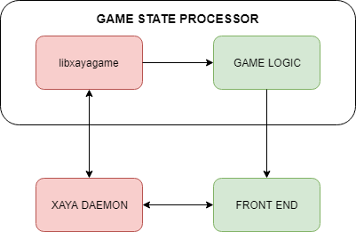

# libxayagame Component Relationships v2

Games built on the XAYA platform have several major components.

- XAYA daemon
- Game state processor
	+ libxayagame
	+ Game logic
- Front end

The daemon is responsible for querying the blockchain.

The game state processor (GSP) is composed of libxayagame and the game logic. It is responsible for computing the current state of the game. 

The libxayagame libary takes care of complex blockchain logic and provides an easy to implement interface for game developers.

Game logic is written by developers for their games. 

The front end is the GUI where end users interact with the game.

# The Relationships Between Those Components

The relationships between the various components can be visualised as shown below. The red components are parts of the XAYA platform. The green components are written by game developers.

## Front End <––> XAYA Daemon <––> libxayagame

The daemon receives requests from the front end and returns responses. These are typically `name_list` (to find the names in the user's wallet) and `name_update` (to submit moves onto the blockchain) operations. 

The daemon also receives requests from libxayagame and returns responses. These are "black box" operations that game developers do not need to worry about.

## libxayagame ––> Game Logic

In addition to the above, libxayagame sends information, such as new game moves, to the game logic. 

## Game Logic ––> Front End

The GSP implements the game logic. Part of that involves connecting to and subscribing to libxayagame. The game logic processes information from libxayagame and creates a new game state that it sends to the front end.

## Game Logic ––> Front End <––> XAYA Daemon

The front end subscribes to updates from the game logic. When a new game state arrives, it updates the GUI for the end users. Those end users can then make new moves that the front end submits to the daemon, which enters those moves into the mempool where XAYA miners can mine them as transactions onto the XAYA blockchain.

Once those moves have been mined into a block, the black box magic of the XAYA daemon and libxayagame sort out what the game logic needs to know and sends it. 

