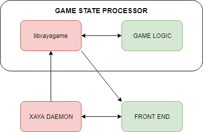
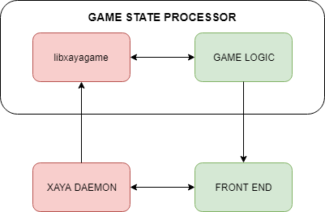
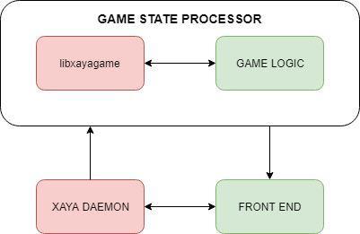

# libxayagame Component Relationships

Games built on the XAYA platform have several major components.

- XAYA daemon
- Game state processor
	+ libxayagame
	+ Game logic
- Front end

The daemon is responsible for querying the blockchain.

The game state processor (GSP) is composed of libxayagame and the game logic. It is responsible for computing the current state of the game. 

The libxayagame library takes care of complex blockchain logic and provides an easy to implement interface for game developers.

Game logic is written by developers for their games. 

The front end is the GUI where end users interact with the game.

# The Relationships Between Those Components

Implementations may differ, but the approach described here mirrors the approach taken in the [Mover sample game](https://github.com/xaya/libxayagame/tree/master/mover).

The relationships between the various components can be visualised as shown below. The red components are parts of the XAYA platform. The green components are written by game developers.

In this diagram, libxayagame is running as an RPC server, i.e. it is a "default" RPC server. However, if you wish to run custom RPCs you can do so in a custom main function, in which case information flow would be between the game logic and the front end. 

### Using Custom RPCs

As Mover is very simple, the above model is sufficient. However, complex games can benefit from using a custom RPC server. Whether the information flow is between libxayagame and the front end or between the game logic and the front end doesn't particularly matter; it's merely a design choice. Running a custom RPC server would then follow this pattern:

The custom RPC server may or may not be included in the game logic. How it is implemented is up to individual developers. 

### The General Case

The general case of how the information flows can be viewed as interaction between the GSP and other components:

The information below is for the first diagram above in order to align with the Mover sample game.

## libxayagame ––> Front End <––> XAYA Daemon ––> libxayagame

The daemon receives requests from the front end and returns responses. These are typically `name_list` (to find the names in the user's wallet) and `name_update` (to submit moves onto the blockchain) operations. 

The daemon also receives requests from libxayagame and returns responses. These are "black box" operations that game developers do not need to worry about.

Further, the front end subscribes to libxayagame for game state updates. 

## libxayagame <––> Game Logic

libxayagame sends information, such as new game moves, to the game logic which processes that data and returns the game state to libxayagame. 

## Game Logic <––> libxayagame ––> Front End <––> XAYA Daemon

The front end subscribes to updates from libxayagame. When a new game state arrives, it updates the GUI for the end users. Those end users can then make new moves that the front end submits to the daemon, which enters those moves into the mempool where XAYA miners can mine them as transactions onto the XAYA blockchain.

Once those moves have been mined into a block, the black box magic of the XAYA daemon and libxayagame sort out what the game logic needs to know, get a response from the game logic, and then libxayagame sends that final game state to the front end. 

The front end is also responsible for starting and stopping the GSP. 

